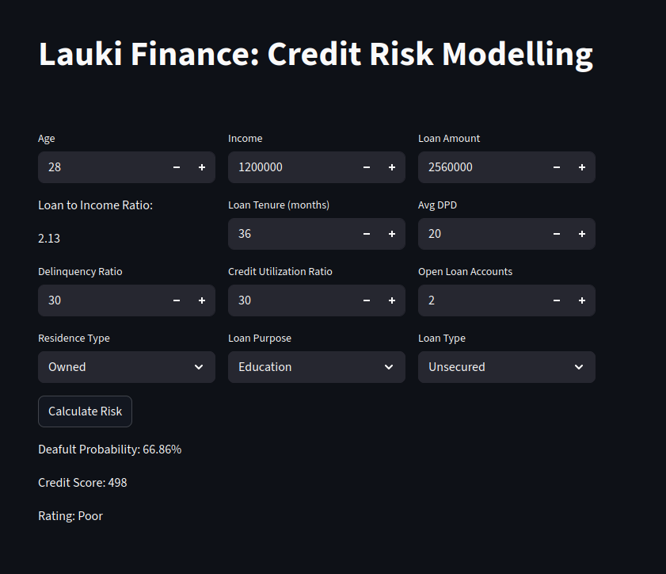

# 💳 Lauki Finance — Credit Risk Modelling

An interactive **Streamlit** app that estimates a borrower’s **default probability**, computes a **credit score**, and assigns a **risk rating** from key financial and behavioral features.

🔗 **Live Demo:** https://mco-ml-project-healthcare-premium-prediction.streamlit.app/

---

## 🚀 What the App Does
- Collects key loan & borrower attributes.
- Predicts **Default Probability** (0–100%).
- Calculates a **Credit Score** and **Risk Rating** (e.g., Poor / Fair / Good).
- Clean, dark-themed UI for quick experimentation.

---

## 🧾 Inputs (Features)
- **Age**
- **Income**
- **Loan Amount**
- **Loan Tenure (months)**
- **Avg DPD per Delinquency**
- **Delinquency Ratio (%)**
- **Credit Utilization Ratio (%)**
- **Open Loan Accounts (count)**
- **Residence Type** (`Owned`, `Rented`, `Mortgage`)
- **Loan Purpose** (`Education`, `Home`, `Auto`, `Personal`)
- **Loan Type** (`Unsecured`, `Secured`)

**Outputs**
- **Default Probability** (e.g., `66.86%`)
- **Credit Score** (e.g., `498`)
- **Rating** (e.g., `Poor`)

---

## 🛠️ Tech Stack
- **Python 3.x**
- **Streamlit** for the web UI
- **scikit-learn** (modeling)
- **pandas / numpy** (data handling)

---

## 📂 Project Structure
~~~text
.
├── main.py                # Streamlit app (UI + feature inputs)
├── prediction_helper.py   # Model loading + predict() helper
├── requirements.txt       # Python dependencies
├── README.md              # Project documentation
├── .gitignore             # Git ignore rules
├── artifacts/             # Stored model artifacts (trained models, scalers, etc.)
└── __pycache__/           # Compiled Python cache files
~~~

---

## ⚡ Run Locally
~~~bash
# Clone the repo
git clone https://github.com/your-username/credit-risk-modelling.git
cd credit-risk-modelling

# (Optional) create & activate a virtual environment
# python -m venv .venv && source .venv/bin/activate   # macOS/Linux
# python -m venv .venv && .venv\Scripts\activate      # Windows

# Install dependencies
pip install -r requirements.txt

# Run the app
streamlit run main.py
~~~

Open in your browser: `http://localhost:8501`

---

## 🧠 How It Works
- The Streamlit UI collects loan and borrower inputs (income, loan amount, tenure, delinquency ratio, credit utilization, etc.).  
- These features are passed to a `predict(...)` helper which loads the trained ML model.  
- The helper returns:
  - **Default Probability (%)**
  - **Credit Score**
  - **Risk Rating (e.g., Poor / Fair / Good)**  
- The results are displayed instantly on the page.

---

## 📸 Screenshot 

---

## 🔗 Links
- **Live App:** [Streamlit Deployment](https://mco-ml-project-healthcare-premium-prediction.streamlit.app/)  
- **My GitHub Profile:** [https://github.com/mmmuhammedcan](https://github.com/mmmuhammedcan)

---

## 🙏 Acknowledgments
Built as part of my ML learning journey with Codebasics companion; inspired by educational materials and real-world use cases.
